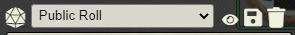

# Quick Blind Rolls

Quick Blind Rolls (QBR) provides a toolbox to make it easier for players to make the occasional blind rolls. Currently, this toolbox is filled with a single blunt tool. I present to you, the Blind Toggle.

A button with an icon of an eye is added to the GM's chat log. Clicking on it will toggle on  ***BLIND MODE***. While you are in ***BLIND MODE***, all public rolls are turned into Blind GM rolls automatically. When you feel like your players have had enough of ***BLIND MODE***, you can simply click the button again to toggle it off.

# License
Quick Blind Rolls is licensed under the MIT License (see LICENSE file), as well as Foundry VTT's [Limited License Agreement for Module Development 05/29/2020](https://foundryvtt.com/article/license/).